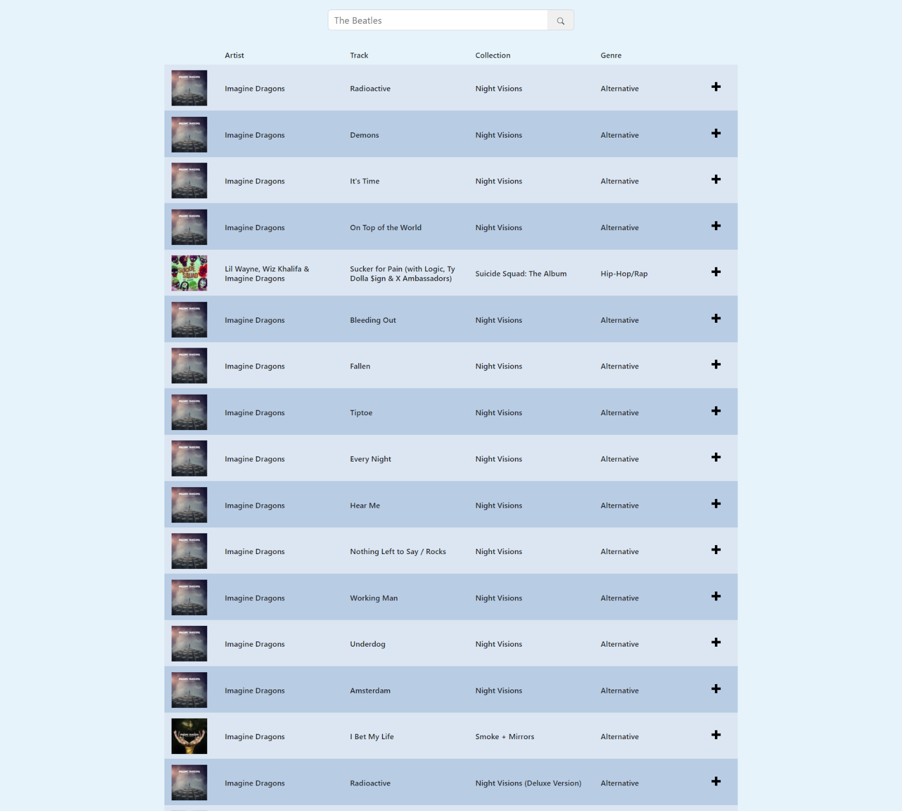

###  An implementation of the `iTunes Tracks List` using:
- HTML/CSS
- Bootstrap
- ReactJs
- Redux
- RTK Query

To search for audio content, input in the search field the name of the artist whose track list
you would like to receive.

The TrackList page displays a list of tracks (songs) with the ability to search.
The data is loaded using an AJAX iTunesAPI request.

#### TrackList should contain:

- Collection image
- Artist/Performer
- Track name
- Collection name
- Genre

The rows in the list must alternate colors.

On clicking one of the tracks, additional information should appear.
On clicking again on the selected row, it should collapse back. When you select another row, the previous one should be collapsed.

