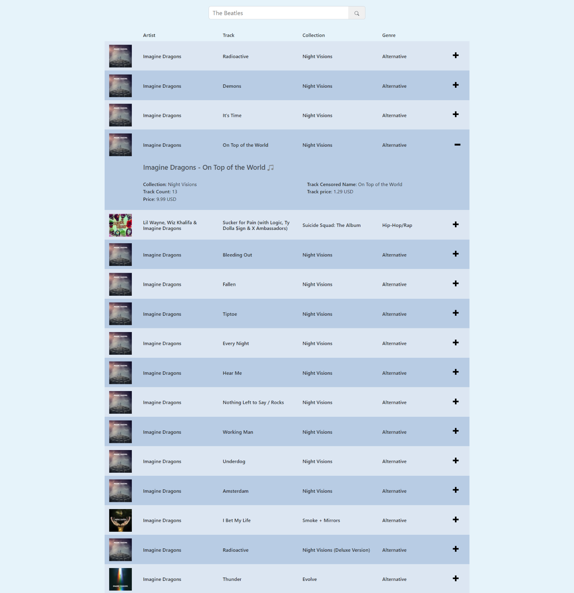

###  An implementation of the `iTunes Tracks List` using:
- HTML/CSS
- Bootstrap
- ReactJs
- Redux
- RTK Query

Generation the list of tracks from the data received from the iTunes API.

To search for audio content, input in the search field the name of the artist whose track list
you would like to receive.

